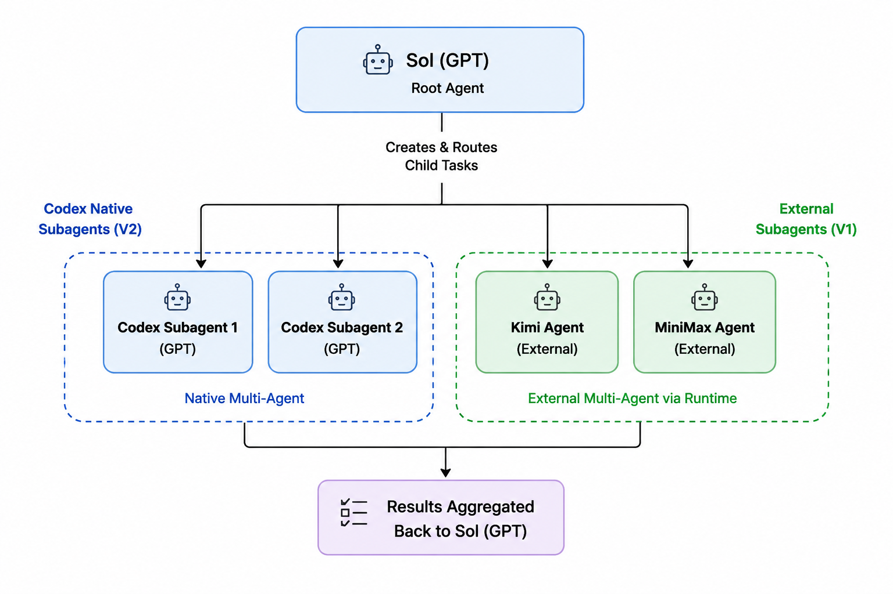

# Codex External Subagent Runtime

[简体中文](README.zh-CN.md)



Enable GPT and external models such as Kimi and DeepSeek to collaborate as
gated subagents in the same Codex task, without requiring native V2
cross-provider child support. Grok Build/CLI integrations stay behind the same
route gates and remain tools until model-child delivery is separately verified.

This standalone runtime repository packages a Bootstrap, Launcher, and Runtime
Route Contract for Codex Desktop.

The runtime creates a project-bound Multi-Agent V1 task with GPT-5.6 Luna,
switches the same task to GPT-5.6 Sol Ultra without a bootstrap turn, and
passes only a sanitized allowlist of locally verified routes. It does not ship
provider credentials, endpoints, adapters, private MCP implementations, or
automatic configuration repair.

## Install and pin an entry

Clone this repository to a stable local path. Keep code and operator state
separate:

```bash
git clone https://github.com/Bing-Bryan/codex-external-subagent-runtime.git
cd codex-external-subagent-runtime
python3 scripts/pinned_entry.py --ready
```

Configure one Codex Desktop pinned entry with a fixed project ID and canonical
working directory. Use the template in
[`templates/pinned-entry.developer-instructions.md`](templates/pinned-entry.developer-instructions.md).
The entry must call `scripts/pinned_entry.py` with those fixed values; the
operator must not provide them in the task message.

The entry protocol is intentionally literal:

* initialization prints exactly `ENTRY_READY`;
* only trimmed, lowercase `new` crosses the gate;
* every other input prints exactly `ONLY_ACCEPTS_NEW`;
* a live launch lock fails closed and is never silently retried.

## Runtime state

Operator-owned state lives outside the repository at
`$CODEX_HOME/codex-external-subagent-runtime/`:

* `projects.json`, based on `examples/projects.example.json`;
* `providers.json`, based on `examples/providers.example.json`;
* `smoke-evidence.json`, written only after a user-approved real smoke test.

Validate registry structure without invoking a provider:

```bash
python3 scripts/validate_registry.py
```

The default mode is `adopt-existing`: the runtime reads enough existing named
agent and MCP metadata to validate shape and compute a fingerprint, but never
reads credential values or repairs, replaces, or switches configuration.

## Launch contract

The App Server sequence is:

```text
initialize
model/list
thread/start(model=gpt-5.6-luna, V1, developerInstructions=allowlist)
thread/settings/update(model=gpt-5.6-sol, effort=ultra)
thread/read(includeTurns=true)
```

There is no Luna prompt, Sol handoff prompt, or `turn/start`. Success requires
V1, zero bootstrap turns, Sol/Ultra settings verification, exact project
binding, and a UUID thread ID. The Multi-Agent V1 boundary is deliberate; see
the next section for the V2 limitation.

After a successful launch, use Desktop controls to set a distinguishable
title, locate the returned thread, verify project ID and canonical cwd, and
navigate only after those checks pass.

## Why this runtime uses Multi-Agent V1

V1 is the compatibility boundary for this implementation because the complete
launch and verification chain has been implemented and tested only for V1:

* Global preflight requires `[features] multi_agent = true` and
  `multi_agent_v2 = false`. When V2 is enabled, the runtime stops before the
  App Server with `global_v1_required`; it does not toggle the global flag or
  silently fall back.
* The App Server request pins the V1 feature set, starts the task as
  `gpt-5.6-luna`, switches that same task to `gpt-5.6-sol` with `ultra`, and
  verifies the resulting settings. There is no V2-specific start, update, or
  read adapter in this repository.
* The concrete V2 limitation is an authorization boundary. The current
  Codex Desktop V2 contract can orchestrate supported OpenAI model roles, but
  its child-task context, control payloads, and OpenAI-produced artifacts are
  not reliably authorizable for a third-party provider to consume. A GPT root
  task therefore cannot safely hand the same V2 child payload to Kimi, MiniMax,
  or another external model. The observed failure modes are repeated HTTP 400
  responses or a child task with empty work.
* V1 is the compatibility path around that boundary: Sol writes an explicit,
  bounded brief and sends it through an allowlisted Responses route, dedicated
  adapter, or MCP tool. The external route is not represented as a native V2
  child. This is why cross-provider delivery stays on V1; it is a protocol
  compatibility decision, not a general claim that V2 is inferior.
* Zero bootstrap turns, exact project binding, route-allowlist injection, and
  no-fallback behavior are all checked against this V1 sequence. V1 evidence
  cannot be reused as evidence for a V2 lifecycle or route contract.
* Supporting V2 would require a separate implementation and a separate
  Desktop acceptance track. Until that work exists, a V2-enabled setup stops
  safely instead of creating a task with unverified semantics.

## Architecture / terminal flow

```text
CODEX EXTERNAL SUBAGENT RUNTIME :: TUI FLOW (ENGLISH)
SCOPE  One post-install task launch | No installation flow | No runtime routing

┌─ VIEW A / USER LAUNCH JOURNEY ───────────────────────────────────────────
│
│  PRECONDITION (NOT PART OF THE JOURNEY)
│  Runtime installed | pinned entry project-bound | providers user-configured
│
│  [A] User opens the project's pinned entry
│      The page shows only: ENTRY_READY
│                         │
│                         ▼
│  [B] User sends the exact lowercase text: new
│      Any other input returns only: ONLY_ACCEPTS_NEW
│                         │
│                         ▼
│  [C] Runtime validates automatically
│      User supplies no projectId, cwd, provider, or model
│                         │
│              ┌──────────┴──────────┐
│              │                     │
│             PASS                  FAIL
│              │                     └─> Short error; no config change/retry
│              ▼
│  [D] Desktop creates and opens the new task
│      Multi-Agent V1 | GPT-5.6 Sol / Ultra | project binding verified
│                         │
│                         ▼
│  [E] User enters the real request in the new task
│
└─ ARRIVAL: user faces Sol Ultra; Luna never processed the real request

┌─ VIEW B / RUNTIME OPERATION LOGIC (ONE EXACT new) ─────────────────────────
│
│  [1] Deterministic entry gate
│      trim(input) == "new"; projectId + canonical cwd are entry-bound
│                         │
│                         ▼
│  [2] Scope and safety preflight
│      READ  project allowlist, global V1 flags, CLI version, model/list
│      GUARD exact projectId/cwd binding, global lock, per-phase timeouts
│                         │
│                         ▼
│  [3] Provider route gate (read-only)
│      Read existing named-agent / MCP metadata, registry, smoke evidence
│      enabled + smoke passed + fingerprint match -> sanitized allowlist
│      Reject a failed route; no repair, switching, or silent fallback
│                         │
│                         ▼  fixed developerInstructions
│  [4] App Server / zero bootstrap turns
│      initialize -> model/list
│      -> thread/start(gpt-5.6-luna, V1, allowlist)
│      -> thread/settings/update(gpt-5.6-sol, ultra)
│      -> thread/read(includeTurns=true)
│      Invariants: turn/start = 0 | bootstrapTurns = 0 | fallback = false
│                         │
│                         ▼
│  [5] Desktop completion
│      Set title -> locate threadId -> verify projectId/cwd -> navigate
│
└─ OUTPUT: one project-bound V1 task owned by GPT-5.6 Sol / Ultra

┌─ WHAT DOES A NORMAL LAUNCH CHANGE? ──────────────────────────────────────
│  READ ONLY  config.toml, agents/*.toml, MCP metadata, registry/evidence
│  CREATE     one persistent Codex task
│  UPDATE     task model/effort, sanitized instructions, title/navigation
│  TEMP       launch.lock, removed on exit
│  NEVER      global config, Agent TOML, MCP, Keychain, CC Switch, secrets
│
│  Installing the runtime is outside one new operation.
│  Smoke recording and explicit config apply are separate; launch calls none.
└─────────────────────────────────────────────────────────────────────────
```

## Route contract

Read [`docs/provider-routing.md`](docs/provider-routing.md) before enabling a
route. A route is exposed only when all of these are true:

1. the registry entry is enabled;
2. local evidence records a passed delivery of the intended kind; and
3. the current configuration fingerprint matches the recorded fingerprint.

The supported classes are `responses-direct`,
`responses-adapter-dedicated`, and bounded read-only `mcp-tool`. A tool is not
a child model, even when it wraps a CLI or SDK. There is no provider priority,
repair, shared-proxy switching, or silent fallback.

Every real external smoke call requires separate user confirmation. The
recorder only records an already observed result and never performs the call:

```bash
python3 scripts/record_smoke_evidence.py \
  --provider-id PROVIDER_ID \
  --confirm-observed-delivery
```

## Configuration helper

`scripts/runtime_config.py plan` is read-only. `apply` is a separate,
explicitly guarded whole-file operation requiring a fresh plan SHA and
`--allow-global-config-write`. It is never called by launch or smoke
recording, and tests use a temporary `CODEX_HOME`.

## Documentation

* [`docs/provider-routing.md`](docs/provider-routing.md) — route and evidence boundary.
* [`MIGRATION.md`](MIGRATION.md) — extraction from the former monorepo layout.

## Tests

```bash
PYTHONDONTWRITEBYTECODE=1 python3 -m compileall -q scripts tests
PYTHONDONTWRITEBYTECODE=1 python3 -m unittest discover -s tests -p 'test_*.py' -v
```

The CI matrix covers Python 3.9 and 3.11. Static tests and a fake App Server
do not prove real Desktop project binding or provider delivery; those remain
separate acceptance gates.

## License

[MIT](LICENSE)
